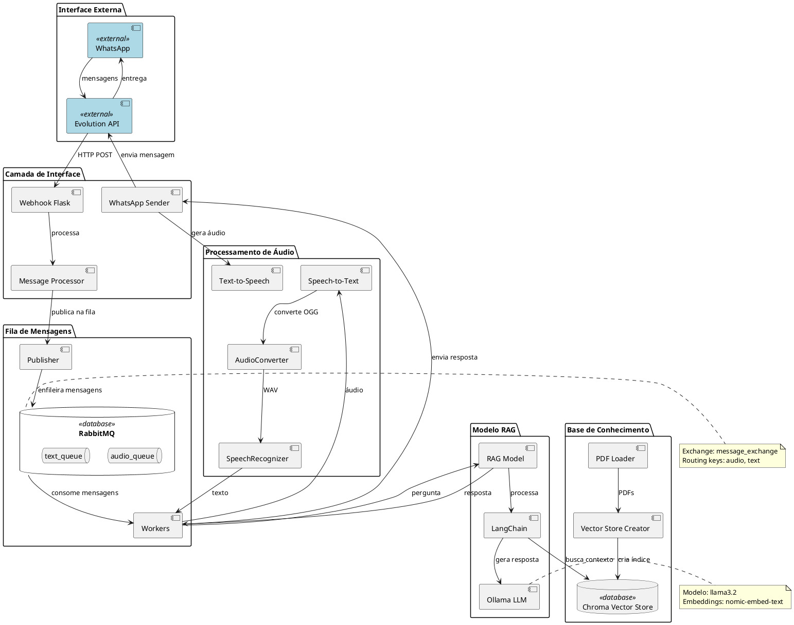

# Diagrama de Arquitetura de Alto Nível

Este diagrama apresenta uma visão geral dos componentes principais do sistema de assistente virtual para diabetes via WhatsApp.

## Descrição dos Componentes

### Interface Externa
- **WhatsApp**: Aplicativo de mensagens usado pelos usuários
- **Evolution API**: API intermediária para conexão com WhatsApp

### Camada de Interface
- **Webhook Flask**: Recebe mensagens via HTTP POST
- **Message Processor**: Classifica mensagens (áudio/texto)
- **WhatsApp Sender**: Envia respostas aos usuários

### Fila de Mensagens
- **RabbitMQ**: Sistema de filas para processamento assíncrono
- **Publisher**: Publica mensagens nas filas
- **Workers**: Processa mensagens das filas

### Processamento de Áudio
- **Speech-to-Text**: Converte áudio em texto
- **Text-to-Speech**: Converte texto em áudio
- **AudioConverter**: Converte OGG para WAV
- **SpeechRecognizer**: Reconhece fala usando Google API

### Modelo RAG
- **RAG Model**: Modelo de Geração Aumentada por Recuperação
- **LangChain**: Framework para LLM
- **Ollama LLM**: Modelo de linguagem local (llama3.2)

### Base de Conhecimento
- **Chroma Vector Store**: Banco vetorial para documentos
- **Vector Store Creator**: Cria índice de documentos
- **PDF Loader**: Carrega PDFs com informações sobre diabetes

## Tecnologias Utilizadas
- **Backend**: Python, Flask
- **Fila de Mensagens**: RabbitMQ (Pika)
- **LLM**: Ollama (llama3.2)
- **Embeddings**: nomic-embed-text
- **Vector DB**: Chroma
- **STT**: Google Speech Recognition
- **TTS**: Coqui TTS (XTTS v2)
- **Audio**: Pydub
