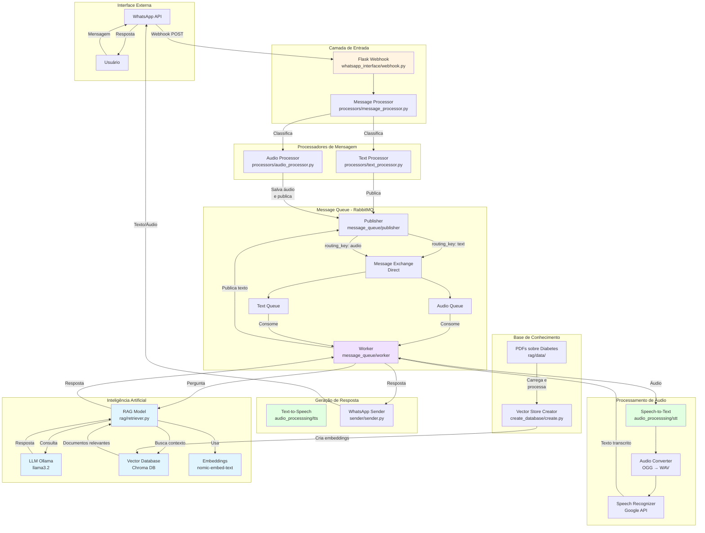

# Diagrama de Arquitetura de Alto Nível

Este diagrama apresenta uma visão geral dos componentes principais do sistema de telemedicina via WhatsApp com foco em diabetes.

## Componentes Principais

1. **Interface Externa**: WhatsApp API para comunicação com usuários
2. **Camada de Entrada**: Flask webhook que recebe e classifica mensagens
3. **Processadores**: Processam mensagens de texto e áudio
4. **Message Queue**: RabbitMQ gerencia filas assíncronas (audio_queue e text_queue)
5. **Processamento de Áudio**: Converte áudio OGG para WAV e transcreve usando Google Speech API
6. **Inteligência Artificial**: RAG (Retrieval-Augmented Generation) com LLM Llama3.2 e Chroma DB
7. **Geração de Resposta**: Converte texto em áudio e envia via WhatsApp
8. **Base de Conhecimento**: PDFs processados e armazenados como embeddings no Chroma DB

## Fluxo de Dados

1. Usuário envia mensagem (texto ou áudio) via WhatsApp
2. Webhook recebe e classifica a mensagem
3. Mensagem é publicada na fila apropriada (text_queue ou audio_queue)
4. Worker consome a mensagem
5. Se áudio, converte e transcreve para texto
6. RAG busca contexto relevante no Vector DB
7. LLM gera resposta baseada no contexto
8. Resposta é enviada de volta ao usuário via WhatsApp
