# Diagrama de Classes UML

Este diagrama mostra a estrutura das classes e seus relacionamentos no sistema.

```mermaid
classDiagram
    %% WhatsApp Interface
    class Flask {
        +app: Flask
        +run()
    }
    
    class MessageProcessor {
        -audio_processor: AudioProcessor
        -text_processor: TextProcessor
        +process(message_payload: dict) MessageType
        -_classify_message(payload: dict) MessageType
        -_is_audio(payload: dict) bool
        -_is_text(payload: dict) bool
    }
    
    class AudioProcessor {
        +BASE_FOLDER: str
        +process(message_payload: dict) void
        -_get_base64_message(message_payload: dict) str
        -_get_file_save_path(message_payload: dict) str
        -_get_user_number(message_payload: dict) str
        -_get_datetime(message_payload: dict) str
        -_save_file(base64_str: str, file_path: str) void
    }
    
    class TextProcessor {
        +process(message_payload: dict) str
    }
    
    class MessageType {
        <<enumeration>>
        AUDIO
        TEXT
        UNKNOWN
    }
    
    class WhatsAppSender {
        +INSTANCE: str
        +SERVER_URL: str
        -headers: dict
        -text_url: str
        -audio_url: str
        -tts_generator: TextToSpeechGenerator
        +__init__(speaker_wav_path: str)
        +text_sender(message: str, number: str) void
        +audio_sender(text: str, number: str) void
        -_set_delay() int
    }
    
    %% Audio Processing
    class SpeechToText {
        -audio_converter: AudioConverter
        -speech_recognizer: SpeechRecognizer
        +__init__(audio_converter: AudioConverter, speech_recognizer: SpeechRecognizer)
        +process(audio_path: str, language: str) str
    }
    
    class AudioConverter {
        +to_wav(input_path: str)$ str
    }
    
    class SpeechRecognizer {
        -recognizer: sr.Recognizer
        +__init__(recognizer: sr.Recognizer)
        +recognize(wav_path: str, language: str) str
    }
    
    class TextToSpeechGenerator {
        -speaker_wav_path: str
        -language: str
        -use_gpu: bool
        -device: str
        -tts: TTS
        +__init__(speaker_wav_path: str, model_name: str)
        +synthesize(text: str, output_path: str) void
    }
    
    %% RAG System
    class RAGModel {
        +EMBEDDING_MODEL: str
        +PERSIST_DIR: str
        +SEARCH_KWARGS: dict
        +MODEL_TEMPERATURE: float
        +MODEL: str
        -embedding: OllamaEmbeddings
        -vectorstore: Chroma
        -retriever: VectorStoreRetriever
        -llm: ChatOllama
        -prompt: ChatPromptTemplate
        -chain: Chain
        +__init__()
        +ask(question: str) str
        +format_docs(docs: list) str
        -_config() void
    }
    
    class VectorStore {
        +CHUNK_SIZE: int
        +CHUNK_OVERLAP: int
        +EMBEDDING_MODEL: str
        +PERSIST_DIR: str
        +DATA_DIR: str
        -docs: list
        -chunks: list
        +__init__()
        +create() void
        +load_pdfs() void
        +chunk_documents() void
        +create_vector_store() void
    }
    
    %% Message Queue
    class Publisher {
        +publish_message(routing_key: str, body: str)$ void
    }
    
    class Worker {
        +start_worker(queue_name: str)$ void
    }
    
    %% External Libraries
    class Chroma {
        <<external>>
        +from_documents()
        +as_retriever()
    }
    
    class ChatOllama {
        <<external>>
        +__init__(model: str, temperature: float)
    }
    
    class OllamaEmbeddings {
        <<external>>
        +__init__(model: str)
    }
    
    class TTS {
        <<external>>
        +tts_to_file()
    }
    
    %% Relationships
    Flask --> MessageProcessor : uses
    MessageProcessor --> AudioProcessor : contains
    MessageProcessor --> TextProcessor : contains
    MessageProcessor --> MessageType : returns
    
    AudioProcessor --> Publisher : publishes to
    TextProcessor --> Publisher : publishes to
    
    WhatsAppSender --> TextToSpeechGenerator : uses
    WhatsAppSender --> Publisher : receives from
    
    SpeechToText --> AudioConverter : uses
    SpeechToText --> SpeechRecognizer : uses
    
    Worker --> SpeechToText : uses
    Worker --> RAGModel : uses
    Worker --> WhatsAppSender : uses
    Worker --> Publisher : publishes to
    
    RAGModel --> Chroma : uses
    RAGModel --> ChatOllama : uses
    RAGModel --> OllamaEmbeddings : uses
    
    VectorStore --> Chroma : creates
    VectorStore --> OllamaEmbeddings : uses
    
    TextToSpeechGenerator --> TTS : uses
```

## Descrição das Classes Principais

### WhatsApp Interface
- **MessageProcessor**: Classifica e direciona mensagens recebidas
- **AudioProcessor**: Processa mensagens de áudio, decodifica base64 e salva arquivos
- **TextProcessor**: Processa mensagens de texto
- **WhatsAppSender**: Envia respostas via WhatsApp (texto ou áudio)

### Audio Processing
- **SpeechToText**: Orquestra a conversão de áudio para texto
- **AudioConverter**: Converte arquivos OGG para WAV
- **SpeechRecognizer**: Realiza o reconhecimento de fala usando Google API
- **TextToSpeechGenerator**: Gera áudio a partir de texto usando Coqui TTS

### RAG System
- **RAGModel**: Implementa o sistema RAG (Retrieval-Augmented Generation)
- **VectorStore**: Cria e gerencia o banco de dados vetorial a partir de PDFs

### Message Queue
- **Publisher**: Publica mensagens nas filas RabbitMQ
- **Worker**: Consome mensagens das filas e coordena o processamento

## Relacionamentos

1. **Composição**: MessageProcessor contém AudioProcessor e TextProcessor
2. **Dependência**: Worker depende de múltiplos componentes (SpeechToText, RAGModel, WhatsAppSender)
3. **Uso**: Múltiplas classes utilizam bibliotecas externas (Chroma, Ollama, TTS)
4. **Comunicação**: Componentes se comunicam através de filas (Publisher)
