# Diagrama de Classes UML

Este diagrama mostra a estrutura das classes e seus relacionamentos no sistema.

```plantuml
@startuml

' Interface WhatsApp
package "whatsapp_interface" {
    class webhook.Flask {
        +app: Flask
        +message_processor: MessageProcessor
        +webhook(): Response
        +run()
    }
    
    class MessageProcessor {
        -audio_processor: AudioProcessor
        -text_processor: TextProcessor
        +process(message_payload: dict): MessageType
        -_classify_message(payload: dict): MessageType
        -_is_audio(payload: dict): bool
        -_is_text(payload: dict): bool
    }
    
    class AudioProcessor {
        -BASE_FOLDER: str = "audios"
        +process(message_payload: dict): void
        -_get_base64_message(payload: dict): str
        -_get_file_save_path(payload: dict): str
        -_get_user_number(payload: dict): str
        -_get_datetime(payload: dict): str
        -_save_file(base64_str: str, path: str): void
    }
    
    class TextProcessor {
        +process(message_payload: dict): str
    }
    
    class WhatsAppSender {
        -INSTANCE: str = "bete"
        -SERVER_URL: str
        -headers: dict
        -text_url: str
        -audio_url: str
        -tts_generator: TextToSpeechGenerator
        +text_sender(message: str, number: str): void
        +audio_sender(text: str, number: str): void
        -_set_delay(): int
    }
    
    enum MessageType {
        TEXT
        AUDIO
        UNKNOWN
    }
}

' Fila de Mensagens
package "message_queue" {
    class Publisher {
        +publish_message(routing_key: str, body: str): void
    }
    
    class Worker {
        -speech_to_text: SpeechToText
        -whatsapp_sender: WhatsAppSender
        -rag_model: RAGModel
        +start_worker(queue_name: str): void
        -callback(ch, method, properties, body): void
    }
    
    class ConfigQueue {
        +connection: Connection
        +channel: Channel
        +exchange_declare(): void
        +queue_declare(): void
        +queue_bind(): void
    }
}

' Processamento de Áudio
package "audio_processsing" {
    class SpeechToText {
        -audio_converter: AudioConverter
        -speech_recognizer: SpeechRecognizer
        +process(audio_path: str, language: str): str
    }
    
    class AudioConverter {
        {static} +to_wav(input_path: str): str
    }
    
    class SpeechRecognizer {
        -recognizer: sr.Recognizer
        +recognize(wav_path: str, language: str): str
    }
    
    class TextToSpeechGenerator {
        -speaker_wav_path: str
        -language: str = "pt"
        -tts: TTS
        -device: str
        -use_gpu: bool
        +synthesize(text: str, output_path: str): void
    }
}

' Modelo RAG
package "rag" {
    class RAGModel {
        -EMBEDDING_MODEL: str = "nomic-embed-text"
        -PERSIST_DIR: str = "./chroma_knowledge"
        -SEARCH_KWARGS: dict = {k: 5}
        -MODEL_TEMPERATURE: float = 0.5
        -MODEL: str = "llama3.2"
        -db: Chroma
        -model: ChatOllama
        -prompt: ChatPromptTemplate
        -chain: Chain
        +ask(question: str): str
        +format_docs(docs: list): str
        -_config(): void
    }
    
    class VectorStore {
        -CHUNK_SIZE: int = 800
        -CHUNK_OVERLAP: int = 150
        -EMBEDDING_MODEL: str = "nomic-embed-text"
        -PERSIST_DIR: str
        -DATA_DIR: str
        -docs: list
        -chunks: list
        +create(): void
        +load_pdfs(): void
        +chunk_documents(): void
        +create_vector_store(): void
    }
}

' Relacionamentos
webhook.Flask *-- MessageProcessor
MessageProcessor *-- AudioProcessor
MessageProcessor *-- TextProcessor
MessageProcessor ..> MessageType : <<uses>>

AudioProcessor ..> Publisher : <<uses>>
TextProcessor ..> Publisher : <<uses>>

Worker *-- SpeechToText
Worker *-- WhatsAppSender
Worker *-- RAGModel
Worker ..> Publisher : <<uses>>

WhatsAppSender *-- TextToSpeechGenerator

SpeechToText *-- AudioConverter
SpeechToText *-- SpeechRecognizer

VectorStore ..> RAGModel : <<creates data for>>

note right of RAGModel
  Usa LangChain para orquestrar:
  - Ollama LLM (llama3.2)
  - Chroma Vector Store
  - Prompt Templates
  
  Sistema RAG para assistente
  de diabetes
end note

note right of Worker
  Processa filas:
  - audio_queue: áudio -> texto
  - text_queue: texto -> RAG -> resposta
end note

note bottom of SpeechToText
  Usa Google Speech Recognition API
  para converter áudio em texto
end note

note bottom of TextToSpeechGenerator
  Usa Coqui TTS (XTTS v2)
  para síntese de voz natural
end note

@enduml
```

## Principais Classes

### Interface WhatsApp
- **Flask**: Aplicação web que recebe webhooks
- **MessageProcessor**: Orquestra processamento de mensagens
- **AudioProcessor**: Processa mensagens de áudio
- **TextProcessor**: Processa mensagens de texto
- **WhatsAppSender**: Envia respostas via Evolution API
- **MessageType**: Enumeração dos tipos de mensagem

### Fila de Mensagens
- **Publisher**: Publica mensagens no RabbitMQ
- **Worker**: Consome e processa mensagens das filas
- **ConfigQueue**: Configura exchange e filas

### Processamento de Áudio
- **SpeechToText**: Coordena conversão de áudio para texto
- **AudioConverter**: Converte formatos de áudio
- **SpeechRecognizer**: Reconhece fala
- **TextToSpeechGenerator**: Gera áudio a partir de texto

### Modelo RAG
- **RAGModel**: Modelo principal de IA conversacional
- **VectorStore**: Cria base de conhecimento vetorial

## Padrões de Design Utilizados
- **Facade**: MessageProcessor simplifica acesso aos processadores
- **Strategy**: Diferentes processadores para tipos de mensagem
- **Factory**: VectorStore cria banco vetorial
- **Dependency Injection**: Workers recebem dependências
- **Singleton-like**: Configurações estáticas nas classes
