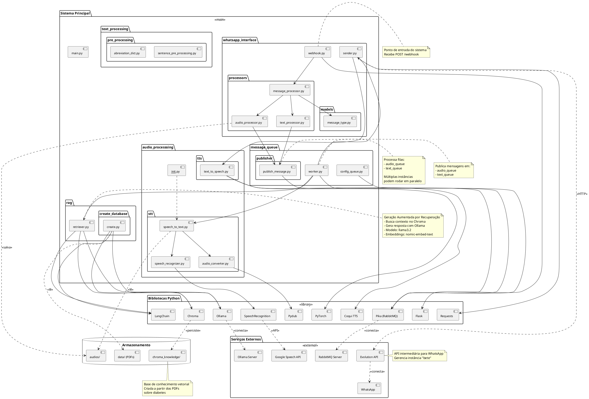

# Diagrama de Componentes

Este diagrama mostra as dependências entre módulos e bibliotecas externas do sistema.



## Dependências Detalhadas

### Módulo: whatsapp_interface

**Dependências Internas:**
- `webhook.py` → `message_processor.py`
- `message_processor.py` → `audio_processor.py`, `text_processor.py`, `message_type.py`
- `audio_processor.py` → `message_queue.publisher`
- `text_processor.py` → `message_queue.publisher`
- `sender.py` → `audio_processsing.tts`

**Dependências Externas:**
- Flask (servidor web)
- Requests (chamadas HTTP)
- Evolution API (serviço)

**Propósito:**
Interface com WhatsApp, recebendo e enviando mensagens

---

### Módulo: message_queue

**Dependências Internas:**
- `worker.py` → `audio_processsing.stt`, `rag.retriever`, `whatsapp_interface.sender`
- `publish_message.py` → Pika

**Dependências Externas:**
- Pika (cliente RabbitMQ)
- RabbitMQ Server (serviço)

**Propósito:**
Sistema de filas para processamento assíncrono e desacoplado

**Configuração:**
- Exchange: `message_exchange` (tipo: direct)
- Filas: `audio_queue`, `text_queue`
- Routing keys: `audio`, `text`

---

### Módulo: audio_processsing

**Dependências Internas:**
- `speech_to_text.py` → `audio_converter.py`, `speech_recognizer.py`

**Dependências Externas:**
- Pydub (manipulação de áudio)
- SpeechRecognition (reconhecimento de fala)
- Coqui TTS (síntese de voz)
- PyTorch (backend para TTS)
- Google Speech API (serviço)
- FFmpeg (dependência do Pydub)

**Propósito:**
Conversão bidirecional entre áudio e texto

**Formatos:**
- Entrada: OGG (WhatsApp)
- Intermediário: WAV (processamento)
- Saída TTS: WAV

---

### Módulo: rag

**Dependências Internas:**
- `retriever.py` → LangChain, Ollama, Chroma
- `create_database/create.py` → LangChain, Ollama, Chroma

**Dependências Externas:**
- LangChain (orquestração LLM)
- langchain_ollama (integração Ollama)
- langchain_chroma (integração Chroma)
- langchain_community (loaders)
- Ollama Server (serviço)

**Propósito:**
Sistema RAG para respostas contextualizadas sobre diabetes

**Configurações:**
- Modelo LLM: llama3.2
- Embeddings: nomic-embed-text
- Vector DB: Chroma
- Top-K: 5 documentos
- Temperature: 0.5

---

### Módulo: text_processing

**Dependências Internas:**
- `sentence_pre_processing.py` → `abreviation_dict.py`

**Dependências Externas:**
- Nenhuma

**Propósito:**
Pré-processamento de texto (normalização, abreviações)

---

## Fluxo de Dependências por Caso de Uso

### Caso 1: Mensagem de Áudio Recebida
```
WhatsApp → Evolution API → webhook.py (Flask)
  → message_processor.py → audio_processor.py
  → publish_message.py (Pika) → RabbitMQ
  → worker.py → speech_to_text.py
  → audio_converter.py (Pydub)
  → speech_recognizer.py (SpeechRecognition + Google API)
  → publish_message.py → RabbitMQ
  → worker.py → retriever.py (RAG)
  → Chroma + Ollama
  → sender.py → Evolution API → WhatsApp
```

### Caso 2: Mensagem de Texto Recebida
```
WhatsApp → Evolution API → webhook.py
  → message_processor.py → text_processor.py
  → publish_message.py → RabbitMQ
  → worker.py → retriever.py (RAG)
  → Chroma + Ollama
  → sender.py → Evolution API → WhatsApp
```

### Caso 3: Criação da Base de Conhecimento
```
create.py → PyPDFLoader → RecursiveCharacterTextSplitter
  → OllamaEmbeddings (nomic-embed-text)
  → Chroma.from_documents
  → chroma_knowledge/
```

## Interfaces Externas

### HTTP APIs
- **Evolution API**: Envio/recebimento de mensagens WhatsApp
- **Google Speech API**: Transcrição de áudio

### Serviços de Rede
- **RabbitMQ**: Message broker (localhost:5672)
- **Ollama**: LLM server (localhost:11434)
- **Evolution API**: WhatsApp gateway (localhost:8080)

### Sistema de Arquivos
- **audios/**: Mensagens de áudio recebidas
- **data/**: PDFs fonte para base de conhecimento
- **chroma_knowledge/**: Base vetorial persistida

## Requisitos de Instalação

### Python Packages (pyproject.toml)
```toml
[dependencies]
flask
pika
langchain
langchain-ollama
langchain-chroma
langchain-community
speechrecognition
pydub
TTS
torch
requests
```

### Serviços Externos Necessários
1. **RabbitMQ**: `docker run -d -p 5672:5672 rabbitmq`
2. **Ollama**: `ollama serve` + `ollama pull llama3.2`
3. **Evolution API**: Servidor WhatsApp
4. **FFmpeg**: Para Pydub funcionar

### Configuração
- Variáveis de ambiente (.env): `AUTHENTICATION_API_KEY`
- Arquivos de configuração: Prompts do RAG em retriever.py
- Estrutura de pastas: audios/, data/, chroma_knowledge/
