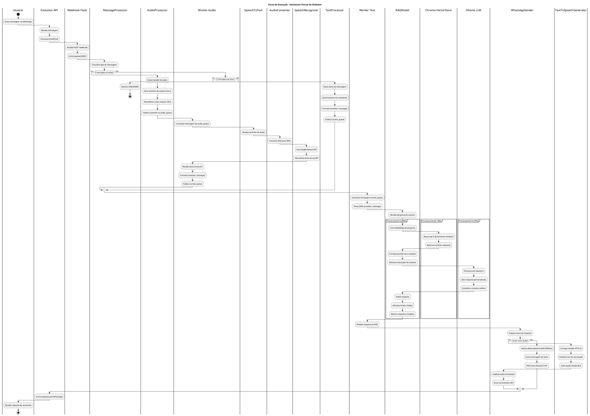

# Diagrama de Fluxo

Este diagrama mostra o fluxo de execução do programa para diferentes cenários.

## Descrição do Fluxo

### 1. Recebimento da Mensagem
- Usuário envia mensagem (texto ou áudio) via WhatsApp
- Evolution API intercepta e encaminha para webhook Flask
- Webhook recebe POST com payload JSON

### 2. Classificação da Mensagem
- MessageProcessor identifica tipo de mensagem
- Redireciona para processador adequado (Audio/Text)

### 3. Processamento de Áudio (se aplicável)
- AudioProcessor salva arquivo OGG localmente
- Publica caminho na fila audio_queue
- Worker consome e inicia transcrição
- AudioConverter transforma OGG em WAV
- SpeechRecognizer usa Google API para transcrição
- Texto transcrito é publicado na text_queue

### 4. Processamento de Texto
- TextProcessor ou Worker Audio publica na text_queue
- Worker Text consome mensagem

### 5. Geração de Resposta (RAG)
- RAGModel recebe pergunta
- Cria embedding da pergunta (nomic-embed-text)
- Busca documentos similares no Chroma (k=5)
- Formata prompt com contexto e instruções
- Ollama (llama3.2) gera resposta contextualizada
- Resposta inclui fontes e orientações médicas

### 6. Envio da Resposta
- WhatsAppSender recebe resposta
- Opcionalmente converte texto em áudio (TTS)
- Envia via Evolution API
- Usuário recebe resposta no WhatsApp

## Características Importantes

### Processamento Assíncrono
- Uso de RabbitMQ para desacoplar componentes
- Filas separadas para áudio e texto
- Workers independentes e escaláveis

### Tratamento de Erros
- SpeechToText lida com erros de reconhecimento
- RAGModel tem fallbacks e validações
- Sistema continua operacional mesmo com falhas parciais

### Otimizações
- Conversão de áudio usa arquivos temporários
- Delay aleatório simula digitação humana
- Cache de embeddings no Chroma

### Segurança e Privacidade
- Áudios salvos localmente por data
- Processamento local (Ollama)
- Sem envio de dados sensíveis para nuvem
