# Diagrama de Fluxo

Este diagrama mostra o fluxo de execução do programa desde o recebimento de uma mensagem até o envio da resposta.

```mermaid
flowchart TD
    Start([Início: Mensagem<br/>recebida no WhatsApp]) --> Webhook{Webhook Flask<br/>recebe POST}
    
    Webhook --> ClassifyMsg[MessageProcessor<br/>classifica mensagem]
    
    ClassifyMsg --> IsAudio{É mensagem<br/>de áudio?}
    
    IsAudio -->|Sim| ProcessAudio[AudioProcessor:<br/>Decodifica base64]
    IsAudio -->|Não| IsText{É mensagem<br/>de texto?}
    
    ProcessAudio --> SaveAudio[Salva arquivo OGG<br/>em /audios/número/data/]
    SaveAudio --> PublishAudio[Publica caminho<br/>na audio_queue]
    
    IsText -->|Sim| ExtractText[TextProcessor:<br/>Extrai texto e número]
    IsText -->|Não| Unknown[Tipo desconhecido<br/>ignora mensagem]
    Unknown --> End([Fim])
    
    ExtractText --> PublishText[Publica na<br/>text_queue]
    
    PublishAudio --> QueueAudio[RabbitMQ:<br/>audio_queue]
    PublishText --> QueueText[RabbitMQ:<br/>text_queue]
    
    QueueAudio --> WorkerAudio{Worker consome<br/>audio_queue}
    QueueText --> WorkerText{Worker consome<br/>text_queue}
    
    WorkerAudio --> ConvertAudio[AudioConverter:<br/>OGG → WAV]
    ConvertAudio --> RecognizeSpeech[SpeechRecognizer:<br/>Google Speech API]
    RecognizeSpeech --> TranscribedText[Texto transcrito]
    TranscribedText --> PublishTranscribed[Publica texto<br/>na text_queue]
    PublishTranscribed --> QueueText
    
    WorkerText --> ExtractData[Extrai número<br/>e mensagem]
    ExtractData --> QueryRAG[RAG Model:<br/>Processa pergunta]
    
    QueryRAG --> CreateEmbedding[Cria embedding<br/>da pergunta]
    CreateEmbedding --> SearchVector[Busca documentos<br/>similares no Chroma DB]
    
    SearchVector --> RetrieveDocs{Documentos<br/>encontrados?}
    
    RetrieveDocs -->|Sim| FormatContext[Formata contexto<br/>com documentos]
    RetrieveDocs -->|Não| EmptyContext[Contexto vazio]
    
    FormatContext --> BuildPrompt[Monta prompt:<br/>Sistema + Contexto + Pergunta]
    EmptyContext --> BuildPrompt
    
    BuildPrompt --> CallLLM[Chama LLM Ollama<br/>modelo: llama3.2]
    
    CallLLM --> LLMThinking{LLM processa<br/>temperatura: 0.5}
    
    LLMThinking --> CheckEmergency{Detecta<br/>emergência?}
    
    CheckEmergency -->|Sim| EmergencyResponse[Resposta de emergência:<br/>Procure atendimento médico]
    CheckEmergency -->|Não| CheckScope{Pergunta sobre<br/>diabetes?}
    
    CheckScope -->|Sim| GenerateResponse[Gera resposta<br/>educativa e empática]
    CheckScope -->|Não| OutOfScope[Resposta: Foco<br/>apenas em diabetes]
    
    EmergencyResponse --> FinalResponse[Resposta final<br/>do LLM]
    GenerateResponse --> FinalResponse
    OutOfScope --> FinalResponse
    
    FinalResponse --> SendFormat{Formato de<br/>envio?}
    
    SendFormat -->|Texto| SendText[WhatsAppSender:<br/>Envia mensagem texto]
    SendFormat -->|Áudio| GenerateTTS[TextToSpeech:<br/>Gera áudio com voz clonada]
    
    GenerateTTS --> SendAudio[WhatsAppSender:<br/>Envia mensagem áudio]
    
    SendText --> WhatsAppAPI[WhatsApp API:<br/>Entrega mensagem]
    SendAudio --> WhatsAppAPI
    
    WhatsAppAPI --> UserReceives[Usuário recebe<br/>resposta]
    UserReceives --> End
    
    style Start fill:#90EE90
    style End fill:#FFB6C1
    style QueryRAG fill:#87CEEB
    style CallLLM fill:#87CEEB
    style CheckEmergency fill:#FFD700
    style EmergencyResponse fill:#FF6B6B
    style WorkerAudio fill:#DDA0DD
    style WorkerText fill:#DDA0DD
    style WhatsAppAPI fill:#98FB98
```

## Descrição do Fluxo

### 1. Recebimento de Mensagem
- Usuário envia mensagem via WhatsApp
- Webhook Flask recebe requisição POST
- MessageProcessor classifica o tipo de mensagem

### 2. Processamento por Tipo

#### Fluxo de Áudio:
1. AudioProcessor decodifica base64
2. Salva arquivo OGG no sistema de arquivos
3. Publica caminho na audio_queue
4. Worker consome mensagem
5. Converte OGG para WAV
6. Transcreve usando Google Speech API
7. Republica texto transcrito na text_queue

#### Fluxo de Texto:
1. TextProcessor extrai texto e número do remetente
2. Publica diretamente na text_queue

### 3. Processamento com RAG
1. Worker consome mensagem da text_queue
2. RAGModel cria embedding da pergunta
3. Busca documentos similares no Chroma DB
4. Formata contexto com os documentos recuperados
5. Monta prompt completo (sistema + contexto + pergunta)
6. Envia para LLM Ollama (llama3.2)

### 4. Geração de Resposta
- LLM analisa a pergunta e contexto
- Detecta emergências médicas
- Verifica se está no escopo (diabetes)
- Gera resposta educativa e empática
- Cita fontes quando apropriado

### 5. Envio de Resposta
- WhatsAppSender envia resposta
- Pode ser texto simples ou áudio gerado (TTS)
- Mensagem é entregue ao usuário via WhatsApp API

## Pontos de Decisão Importantes

- **Classificação de mensagem**: Determina o fluxo (áudio vs texto)
- **Detecção de emergência**: Prioriza segurança do usuário
- **Verificação de escopo**: Mantém foco em diabetes
- **Formato de resposta**: Texto ou áudio conforme configuração
