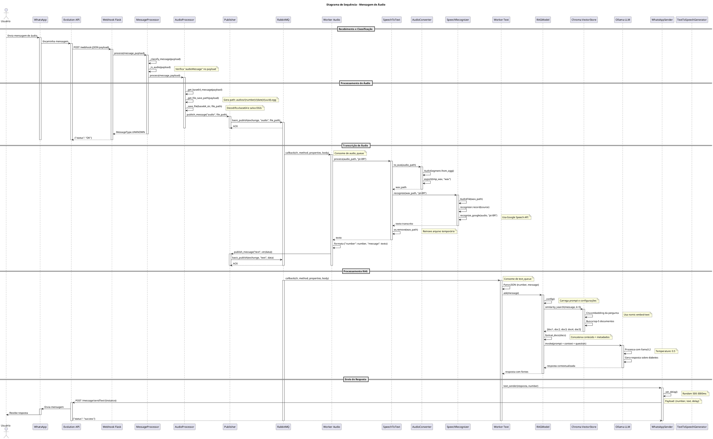
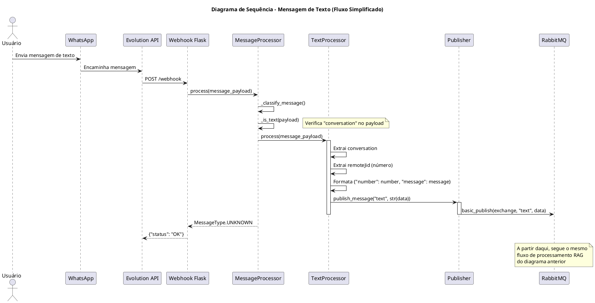
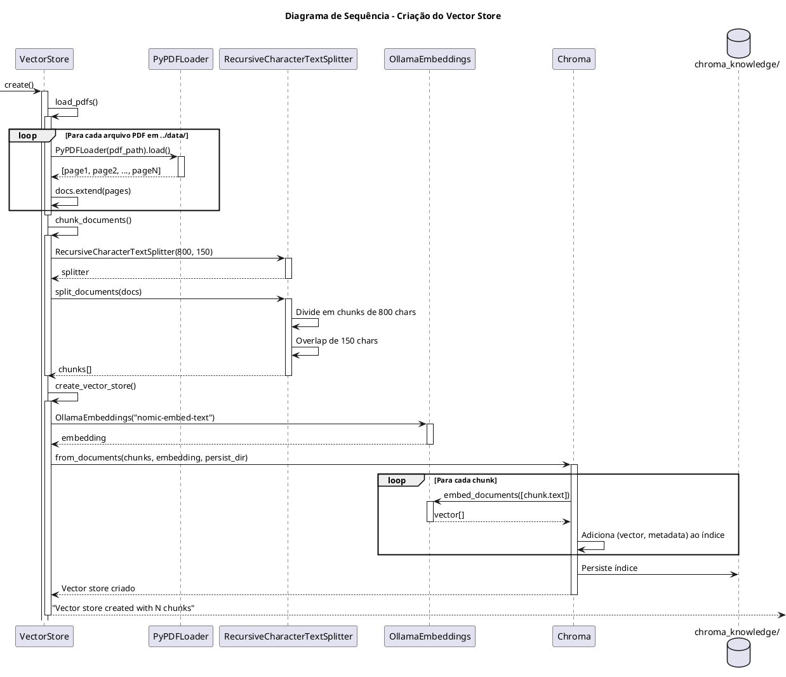

# Diagrama de Sequência

Este diagrama mostra a interação entre componentes durante o processamento de mensagens.

## Sequência Alternativa: Mensagem de Texto

## Sequência: Criação da Base de Conhecimento

## Pontos-Chave das Sequências

### Mensagem de Áudio
1. **Recepção**: WhatsApp → Evolution API → Webhook Flask
2. **Salvamento**: Base64 decodificado e salvo como .ogg
3. **Enfileiramento**: Caminho do arquivo publicado na audio_queue
4. **Transcrição**: OGG → WAV → Google Speech API → Texto
5. **Reprocessamento**: Texto publicado na text_queue
6. **RAG**: Busca contexto + LLM gera resposta
7. **Resposta**: Enviada via Evolution API

### Mensagem de Texto
- Pula etapas de transcrição
- Vai direto para text_queue
- Segue mesmo fluxo RAG

### Criação do Vector Store
- Carrega PDFs da pasta ../data/
- Divide em chunks (800 chars, overlap 150)
- Gera embeddings com nomic-embed-text
- Persiste em Chroma

### Características do Sistema
- **Assíncrono**: Filas desacoplam processamento
- **Resiliente**: Erros não param todo sistema
- **Escalável**: Workers podem ser multiplicados
- **Contextual**: RAG fornece respostas precisas sobre diabetes
