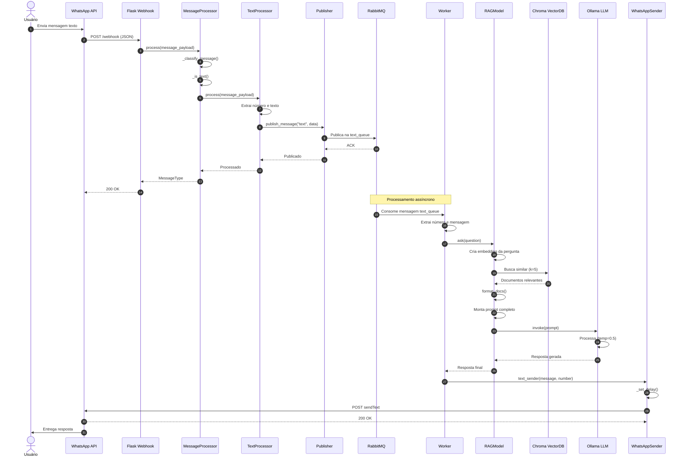
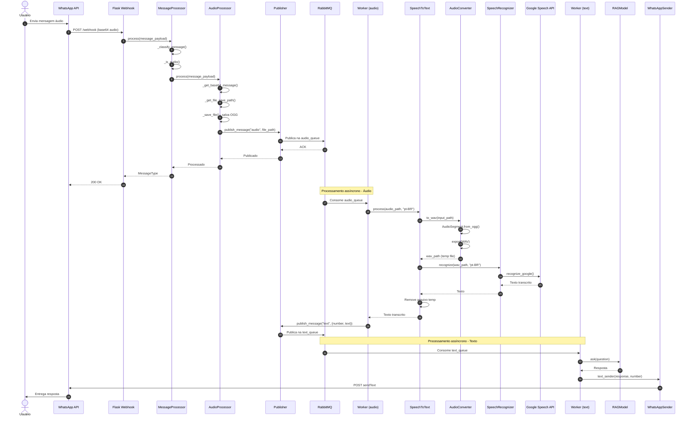
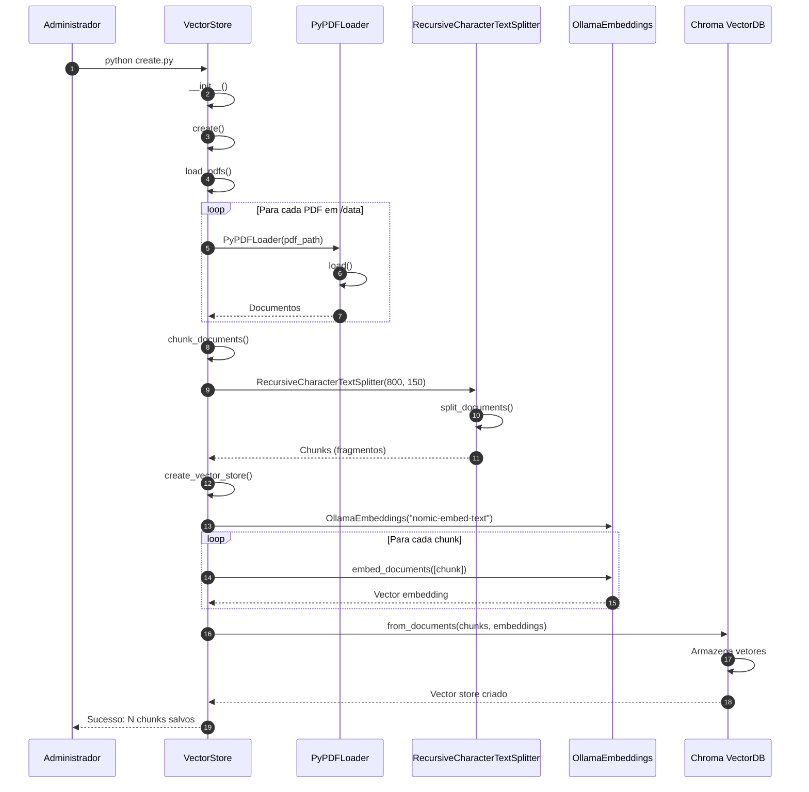
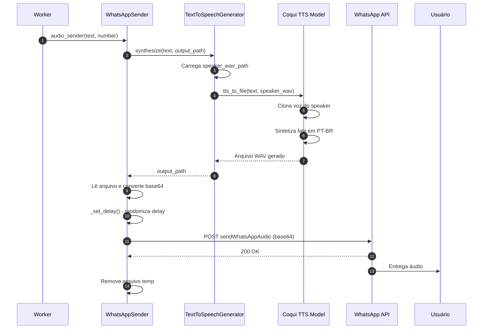

# Diagrama de Sequência

Este diagrama mostra a interação entre componentes ao longo do tempo para processar uma mensagem.

## Cenário 1: Processamento de Mensagem de Texto

## Cenário 2: Processamento de Mensagem de Áudio

## Cenário 3: Criação do Vector Database (Setup Inicial)

## Cenário 4: Envio de Resposta com Áudio (TTS)

## Descrição dos Cenários

### Cenário 1: Texto
Fluxo completo de processamento de mensagem de texto, desde a recepção até o envio da resposta gerada pelo RAG/LLM.

**Pontos-chave:**
- Processamento síncrono até a fila (passos 1-13)
- Processamento assíncrono via Worker (passos 14-26)
- RAG busca contexto antes de consultar LLM

### Cenário 2: Áudio
Fluxo de processamento de mensagem de áudio, incluindo transcrição e subsequente processamento como texto.

**Pontos-chave:**
- Salva áudio físico antes de publicar na fila
- Conversão OGG→WAV necessária para reconhecimento
- Transcrição via Google Speech API
- Republicação como texto para processamento RAG

### Cenário 3: Setup
Processo de criação inicial do banco de dados vetorial a partir de PDFs sobre diabetes.

**Pontos-chave:**
- Execução única durante setup
- Carrega e fragmenta múltiplos PDFs
- Cria embeddings com modelo Ollama
- Armazena vetores no Chroma DB

### Cenário 4: TTS
Geração e envio de resposta em formato de áudio usando síntese de voz.

**Pontos-chave:**
- Clonagem de voz a partir de amostra
- Sintetização em português do Brasil
- Conversão para base64 para envio via API
- Limpeza de arquivos temporários

## Interações Principais

1. **Assíncronas**: Webhook→Queue→Worker (desacoplamento)
2. **Síncronas**: Worker→RAG→LLM (pipeline sequencial)
3. **Externa**: Google Speech API, WhatsApp API
4. **Persistência**: Chroma VectorDB, Sistema de arquivos (áudios)
